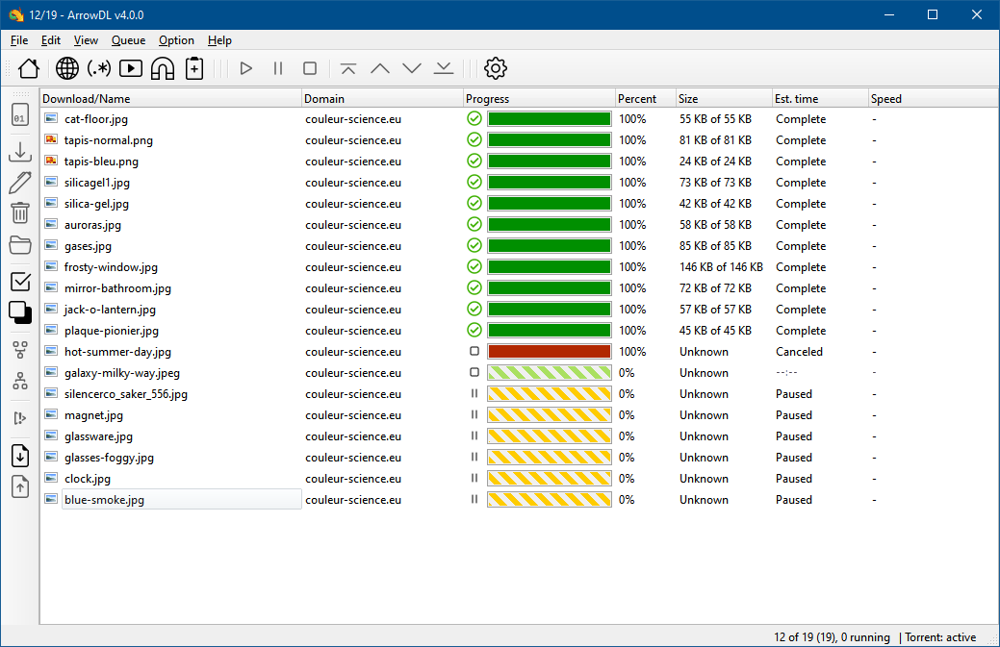

<div align="center">
     
[](#readme)

# ArrowDL (Arrow Downloader)

[](../../releases/latest)
[](LICENSE) 


[](https://addons.mozilla.org/firefox/addon/arrow-dl/ "Mozilla Firefox Add-on")
[](https://community.chocolatey.org/packages/arrowdl)


</div>

## Overview

*ArrowDL* is a standalone download manager for Windows, MacOS and Linux. 

It aims to work with latest versions of Mozilla Firefox (powered by *WebExtensions*), and other web browsers (Chrome, Edge, Safari...). 


## Development

*ArrowDL* is written in C++ and based on the [Qt](https://www.qt.io/ "https://www.qt.io/") framework.

| master | develop |
|---------|-----------|
| [](https://github.com/setvisible/ArrowDL/actions "Go to GitHub Actions") | [](https://github.com/setvisible/ArrowDL/actions "Go to GitHub Actions") |


## Screenshots

<details>
<summary>Overview</summary>



</details>
<details>
<summary>Video Streams</summary>


</details>
<details>
<summary>Webpage Content</summary>


</details>
<details>
<summary>Batch of Files</summary>


</details>

More screenshots on the [Gallery](https://www.arrow-dl.com/ArrowDL/category/screenshots.html "Go to Screenshots page") page.


## Installation

Go to [Download](https://www.arrow-dl.com/ArrowDL/category/download.html) page to install the application for your operating system.

Rem: *Native-Client* is an alternative to *ArrowDL*. Click [here](NativeClient.md "NativeClient.md") for more information.

On Windows, you can also use the [Chocolatey package](https://community.chocolatey.org/packages/arrowdl) to handle the installation/updates:
```powershell
choco install arrowdl
```

## Usage

Go to [Tutorial](https://www.arrow-dl.com/ArrowDL/category/tutorial.html) page.

## Under the hood

*ArrowDL* is a standalone application, embedding its own web engine. That is, it aims to be free and independent, and not rely on any third-party Web Browser technology.

The internal web engine is currently:

* [Google Gumbo Parser](https://github.com/google/gumbo-parser "https://github.com/google/gumbo-parser"), for the **MinGW** and **GNU** versions. 

     Gumbo is a small pure-C HTML5 parser (but doesn't parse Javascript)

* [Chromium](https://fr.wikipedia.org/wiki/Chromium "https://fr.wikipedia.org/wiki/Chromium"), for the **MSVC** version.

     Chromium is a powerful web engine (parses HTML+Javascript)

When we give an URL address to *ArrowDL*, *ArrowDL* downloads the page, parses the HTML page and collects the links.

Due to rapid evolution of web technology, *ArrowDL* is designed to implement new parsers or add existing ones if required.


## Code of Conduct

Click [here](CODE_OF_CONDUCT.md "CODE_OF_CONDUCT.md") for Code of Conduct.


## Translations

Click [here](TRANSLATORS.md "TRANSLATORS.md") for translator guide.


## Build with QtCreator on Windows

Assuming that the configured Kit in QtCreator is the auto-detected *Desktop Qt 6.3.1 MinGW 64-bit (by default)*. (see **Tools** > **Options** > **Kits**)

Assuming that libtorrent is already compiled.

1. **File** > **Open File or Project...**. 
   Select `./CMakeLists.txt`

1. Go to page **Debug**. Click **Configure**

1. Go to page **Projects**.
   Select **Build** > **Parameters**    
   Set the values:
    - *Boost_ROOT*: "path/to/Boost"
    - *LibtorrentRasterbar_ROOT*: "path/to/libtorrent"

    Eventually, if OpenSSL path is not recognized, set explicitly:
    - *OpenSSL_ROOT_DIR*: "(path/to/Qt6)/Tools/OpenSSL/Win_x64"

    Moreover,
    - *CMAKE_INSTALL_PREFIX*: Chose another install path.

1. Click **Run CMake**.

1. Go to page **Editor**. Build. Run.

1. To install: go to page **Projects**.
    Select **Build** > **Parameters**.
    In Step *Build*, check *install* amongst the targets, thus CMake will build and install.


## Other builds

Click [here](CONTRIBUTING.md "CONTRIBUTING.md") for build instructions and tips.


## License and Disclaimer

The code is released under the GNU [Lesser General Public License (LGPL)](LICENSE "LICENSE").

Use it at your own risk. None of the authors, contributors, or anyone else connected with this ArrowDL software and the DownRightNow web-extension, in any way whatsoever, can be responsible for your use of the application. 

Please be aware that this site contains copyrighted material the use of which has not always been specifically authorized by the copyright owner.
