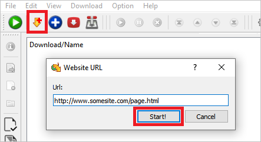
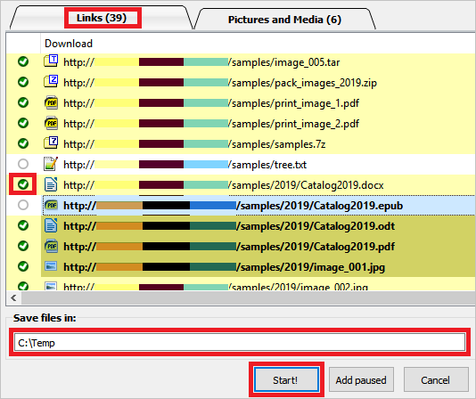
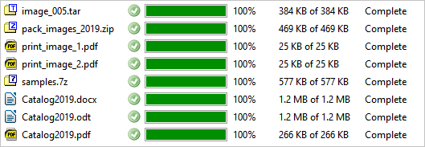
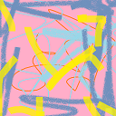
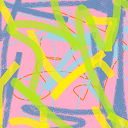

This page contains a brief tutorial, that will help you use the application for the first time.
It contains some dummy data to run the application.

## Get Started

1. Open *DownZemAll*
    - *Start Menu* > *DownZemAll*
    > Or alternatively, open *DownRightNow* from your web browser (-> toolbar menu, or right-click context menu)

2. Open the wizard
    - copy-paste the URL
        > Or alternatively, click 'immediate download' from *DownRightNow*
    
    
    

3. Make your selection and define your path:
    
    

4. Start... et Voilà!
    
    

 

**>> Try to download the content of this page**

The page contains a lot of files, to demonstrate how the application works

---

## Quick Sample

Content:

--- | --- | --- | --- | ---
 |  |  |  | 

Links:

* [samples/animation.gif](../samples/animation.gif)
* [samples/Catalog2019.html](../samples/Catalog2019.html)
* [samples/image_001.png](../samples/image_001.png)
* [samples/image_002.png](../samples/image_002.png)
* [samples/image_003.png](../samples/image_003.png)
* [samples/image_004.png](../samples/image_004.png)
* [samples/image_005.png](../samples/image_005.png)
* [samples/image_005.tar](../samples/image_005.tar)
* [samples/pack-images-2019.zip](../samples/pack-images-2019.zip)
* [samples/print_image_1.pdf](../samples/print_image_1.pdf)
* [samples/print_image_2.PDF](../samples/print_image_2.PDF)
* [samples/samples.7z](../samples/samples.7z)
* [samples/tree.txt](../samples/tree.txt)
* [samples/2019/Catalog2019.docx](../samples/2019/Catalog2019.docx)
* [samples/2019/Catalog2019.epub](../samples/2019/Catalog2019.epub)
* [samples/2019/Catalog2019.odt](../samples/2019/Catalog2019.odt)
* [samples/2019/Catalog2019.pdf](../samples/2019/Catalog2019.pdf)
* [samples/2019/image_001.jpg](../samples/2019/image_001.jpg)
* [samples/2019/image_002.JPG](../samples/2019/image_002.JPG)
* [samples/2019/image_003.JPG](../samples/2019/image_003.JPG)
* [samples/2019/image_004.jpg](../samples/2019/image_004.jpg)
* [samples/2019/image_005.Jpg](../samples/2019/image_005.Jpg)
* [samples/2020/all-2020.zip](../samples/2020/all-2020.zip)
* [samples/2020/Catalog2020.txt](../samples/2020/Catalog2020.txt)
* [samples/2020/monotype-01.bmp](../samples/2020/monotype-01.bmp)
* [samples/2020/monotype-02.BMP](../samples/2020/monotype-02.BMP)

License for these samples: [CC-BY](https://creativecommons.org/licenses/by/3.0/ "https://creativecommons.org/licenses/by/3.0/")
